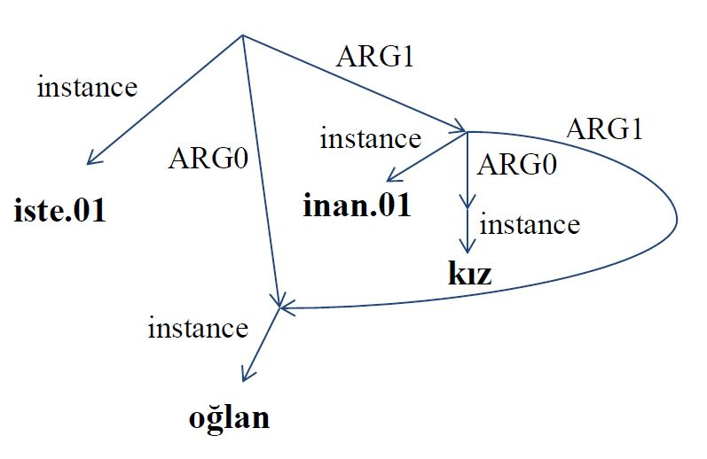

Turkish Abstract Meaning Representation (AMR) Guideline
=============================
_Ali Acar, Elif Oral, Gülşen Eryiğit_

This guideline provides our Turkish AMR annotation schema.
For the explanation of the general AMR concepts, the reader is directed to the English AMR guidelines [[Banarescu et al.]](#References)  by provided links.
Below, Turkish samples and Turkish specific AMR constructions are provided.

<!-- START doctoc generated TOC please keep comment here to allow auto update -->
<!-- DON'T EDIT THIS SECTION, INSTEAD RE-RUN doctoc TO UPDATE -->
**Table of Contents**  *generated with [DocToc](https://github.com/thlorenz/doctoc)*

- [Part I. Introduction](#part-i-introduction)
  - [Abstraction away from the Language](#abstraction-away-from-the-language)
  - [More Logical than Syntax](#more-logical-than-syntax)
  - [Focus](#focus)
  - [AMR slogans](#amr-slogans)
  - [Limitations of Turkish AMR](#limitations-of-turkish-amr)
- [Part II.  Concepts and relations](#part-ii--concepts-and-relations)
- [Part III.  Phenomena](#part-iii--phenomena)
  - [Core roles](#core-roles)
  - [Modality](#modality)
  - [Negation](#negation)
  - [Questions](#questions)
  - [Choice Questions](#choice-questions)
  - [Imperative and Expressive mode](#imperative-and-expressive-mode)
  - [Articles, plurals, tense, aspect, quotes, hyphens](#articles-plurals-tense-aspect-quotes-hyphens)
  - [Implicit roles](#implicit-roles)
  - [Implicit concepts](#implicit-concepts)
  - [Main verb “be” (Copula)](#main-verb-be-copula)
  - [Nouns that invoke predicates](#nouns-that-invoke-predicates)
  - [Adjectives that invoke predicates](#adjectives-that-invoke-predicates)
  - [Adverbs that invoke predicates](#adverbs-that-invoke-predicates)
  - [Verbs derived from nominals](#verbs-derived-from-nominals)
  - [Nominals derived from nominals](#nominals-derived-from-nominals)
  - [Voices](#voices)
  - [Non-core roles](#non-core-roles)
    - [`:source`](#source)
    - [`:destination`](#destination)
    - [`:path`](#path)
    - [`:beneficiary`](#beneficiary)
    - [`:accompanier`](#accompanier)
    - [`:topic`](#topic)
    - [`:duration`](#duration)
    - [`:instrument`](#instrument)
    - [`:medium`](#medium)
    - [`:manner`](#manner)
    - [`:purpose`](#purpose)
    - [`:cause`](#cause)
    - [`:concession`](#concession)
    - [`:condition`](#condition)
    - [`:part`](#part)
    - [`:subevent`](#subevent)
    - [`:consist-of`](#consist-of)
    - [`:example`](#example)
    - [`:direction`](#direction)
    - [`:frequency`](#frequency)
    - [`:extent`](#extent)
  - [Focus](#focus-1)
  - [Reification](#reification)
  - [Phrasal Verbs](#phrasal-verbs)
  - [Turkish Case Markers](#turkish-case-markers)
  - [Postpositions](#postpositions)
  - [Noun Compounds](#noun-compounds)
  - [Turkish Clitics](#turkish-clitics)
  - [Relative Clauses](#relative-clauses)
  - [Multiple relations with the same name](#multiple-relations-with-the-same-name)
  - [Conjunctions](#conjunctions)
  - [Quantifiers and scope](#quantifiers-and-scope)
  - [Degree](#degree)
  - [Reduplications](#reduplications)
  - [Variables and co-reference](#variables-and-co-reference)
  - [Possession](#possession)
  - [Pertainyms](#pertainyms)
  - [Ordinals](#ordinals)
  - [Subsets](#subsets)
  - [Named Entities](#named-entities)
  - [Special Frames for Roles](#special-frames-for-roles)
  - [Exact numbers](#exact-numbers)
  - [Approximate numbers](#approximate-numbers)
  - [Quantities](#quantities)
  - [Mathematical operators](#mathematical-operators)
  - [Other entities: dates, times, percentages, phone, email, URLs](#other-entities-dates-times-percentages-phone-email-urls)
  - [References](#references)

<!-- END doctoc generated TOC please keep comment here to allow auto update -->

Part I. Introduction
====================

For the definition of this section, you may check the English AMR guideline [related section](https://github.com/amrisi/amr-guidelines/blob/master/amr.md#part-i-introduction).

<p>
  <br>
  AMR Graph for <i>"Oğlan kızın ona inanmasını istiyor." (The boy wants the girl to believe him.)</i>
</p>

And the text-friendly way is below:
```lisp
(i / iste.01
      :ARG0 (o / oğlan)
      :ARG1 (i2 / inan.01
            :ARG0 (k / kız)
            :ARG1 o))
```

Above AMR graph can also be viewed as conjuction of logical triplets. The following shows the example above in this form, omitting root information:

```
instance(i, iste.01) ^         /* i is an instance of "istemek" (wanting) */
instance(o, oğlan) ^           /* o is an instance of "oğlan" (boy) */
instance(i2, inan.01) ^        /* i2 is an instance of "inanmak" (believing) */
instance(k, kız) ^             /* k is an instance of "kız" (girl) */
ARG0(i, o) ^                   /* o is the "isteyen" (wanter) in i */
ARG1(i, i2) ^                  /* i2 is the "istenen" (wantee) in i */
ARG0(i2, k) ^                  /* g is the "inanan" (believer) in i2 */
ARG1(i2, o)                    /* o is the "inanılan" (believee) in i2 */
```

Abstraction away from the Language
-----------------------------

For the definition of this section, you may check the English AMR guideline [related section](https://github.com/amrisi/amr-guidelines/blob/master/amr.md#abstraction-away-from-english).


There are various ways to express the example AMR graph above: 
```
Oğlan kızın ona inanmasını istiyor.
Oğlan kız tarafından inanılmak istiyor.
Oğlan kız tarafından inanılmak isteğine sahip.
Oğlanın isteği kızın ona inanması.
Oğlan kızın ona inanması için istekli.
```
etc.

More Logical than Syntax
------------------------

For the definition of this section, you may check the English AMR guideline [related section](https://github.com/amrisi/amr-guidelines/blob/master/amr.md#more-logical-than-syntax).

The following two examples are syntactically similar but the placement of polarity in the AMR graph is different,

```lisp
(m / mümkün.01
      :ARG1 (g / gel.01
            :ARG0 (a / araba)
            :time (b / bugün))
      :polarity -)
```
> Araba bugün gelemez.
>
> _The car can not arrive today._

```lisp
(m / mümkün.01
      :ARG1 (g / gel.01
            :ARG0 (a / araba)
            :time (b / bugün)
            :polarity -))
```
> Araba bugün gelmeyebilir.
>
> _The car may not arrive today._

Focus
-----
For the definition of this section, you may check the English AMR guideline [related section](https://github.com/amrisi/amr-guidelines/blob/master/amr.md#focus).

```lisp
(b / beyaz
   :domain (m / mermer))
```

> Mermer beyazdır.
>
> _The marble is white._
>
> mermerin beyazlığı
>
> _the whiteness of the marble_

The `:mod` relation is short version of the inverse role of `:domain` which is `:domain-of`,

```lisp
(m / mermer
   :mod (b / beyaz))
```

> beyaz mermer
>
> _the white marble_
>
> beyaz olan mermer

```lisp
(g / gör.01
      :ARG0 (o / oğlan)
      :ARG1 (b / beyaz
            :domain (m / mermer)))
```

> Oğlan mermerin beyaz olduğunu görüyor.
> 
> _The boy sees that the marble is white._
>
> Oğlan mermerin beyazlığını gördü.
>
> _The boy sees the whiteness of the marble._


```lisp
(g / gör.01
      :ARG0 (o / oğlan)
      :ARG1 (m / mermer
            :mod (b / beyaz)))
```

> Oğlan beyaz mermeri görüyor.
> 
> _The boy sees the white marble._
>
> Oğlan beyaz olan mermeri görüyor.
>
> _The boy sees the marble that is white._

```lisp
(g / gör.01
      :ARG0 (o / oğlan)
      :ARG1 (k / kız
            :ARG0-of (i / iste.01
                  :ARG1 o)))
```

> Oğlan onu isteyen kızı gördü.
>
> _The boy saw the girl who wanted him._


```lisp
(i / iste.01
      :ARG0 (k / kız
            :ARG1-of (g / gör.01
                  :ARG0 (o / oğlan)))
      :ARG1 o)
```

> Oğlan tarafından görülen kız onu istiyor.
>
> _The girl who was seen by the boy wants him._


AMR slogans
-----------

For the definition of this section, you may check the English AMR guideline [related section](https://github.com/amrisi/amr-guidelines/blob/master/amr.md#amr-slogans).

Limitations of Turkish AMR
--------------------------

Turkish AMR framework covers the important features of Turkish. 
As future studies, the framework will be updated on the progress of the research.


Part II.  Concepts and relations
================================
For the definition of this section, you may check the English AMR guideline [related section](https://github.com/amrisi/amr-guidelines/blob/master/amr.md#part-ii--concepts-and-relations).

Part III.  Phenomena
====================

Core roles
----------

For the definition of this section, you may check the English AMR guideline [related section](https://github.com/amrisi/amr-guidelines/blob/master/amr.md#core-roles).

Turkish AMR inherits core roles from the Turkish Propbank [[Sahin and Adali]](#References).

- `:ARG0` of `ver.01` (_give_) is the person/thing doing the giving.
- `:ARG1` of `ver.01` (_give_) is the thing being given.
- `:ARG2` of `ver.01` (_give_) is the thing/person recipient of the `:ARG1`.


```lisp
(v / ver.01
      :ARG0 (a / anne
            :poss (b / ben))
      :ARG1 (e / elma)
      :ARG2 (s / sen))
```

> Annem sana elma verdi.
> 
> _My mother gave you an apple._


```lisp
(t / açıkla.01
   :ARG0 (o / o)
   :ARG1 (g / görev)
   :ARG2 (b / başar.01
      :polarity -))
```

> Görevi bir başarısızlık olarak açıkladı.
>
> _He described the mission as a failure._
>
> Açıkladığı gibi, görev bir başarısızlıktı.
>
> _As he described it, the mission was a failure._
>
> Göreve ilişkin açıklaması: başarısızlık.
> 
> _His description of the mission: failure._


If a predicate is missing in the Turkish PropBank, it is indicated by `.00` in the Turkish AMR annotations.


```lisp
(g / grup
  :consist-of (p / person
                :ARG0-of (y / yağmala.00)))
```

> bir grup yağmacı
>
> _a band of marauders_

Modality
--------

_This chapter is depicted under the Modality subsection in our paper._

Modality in Turkish is constructed with suffixes such as `-mAlI`, `AbIl` and with some nominals such as `lazım`, `gerek`, `mümkün`.

Special concepts are used English AMR to represent modality like `possible-01`, `likely-01`, `obligate-01`, `permit-01`, `recommend-01`, `prefer-01`, etc.

For Turkish AMR, these English concepts are mapped to corresponding Turkish frames like `mümkün.01`(ability and possibility), 
`zorla.01`(obligation), `ver.09`(permission), `öner.01`(recommendation), `gerek.01`(necessity).

```lisp
(m / mümkün.01
   :ARG1 (g / git.01
           :ARG0 (o / oğlan)))
```

> Oğlan gidebilir.
>
> _The boy can go._
>
> Oğlanın gitmesi mümkündür.
>
> _It is possible that the boy goes._


```lisp
(z / zorla.01
   :ARG1 (o / oğlan)
   :ARG2 (g / git.01))
```

> Oğlan gitmeli.
>
> _The boy must go._
>
> Oğlan gitmek zorunda.
>
> _The boy is obligated to go._
>
> Oğlanın gitmesi zorunludur.
>
> _It is obligatory that the boy go._


```lisp
(v / ver.09
   :ARG1 (g / git.01)
   :ARG2 (o / oğlan))
```

> Oğlan gidebilir.
>
> _The boy may go._
>
> Oğlanın gitmesine izin verildi.
>
> _The boy is permitted to go._


```lisp
(v / ver.09
      :ARG0 (p / person
               :ARG0-of (ö / öğret.01))
      :ARG1 (k / konuş.01)
      :ARG2 (p2 / person
                :ARG0-of (ö2 / öğren.01)))
```

> Öğretmen öğrencilerin konuşmasına izin verdi.
> 
> _The teacher permitted the students to talk._

```lisp
(m / mümkün.01
   :ARG1 (y / yağ.00
            :ARG0 (y2 / yağmur)))
```

> Yağmur yağabilir.
>
> _It may rain._
>
> Yağmur yağması olasıdır.
>
> _Rain is possible._


```lisp
(g / gerek.01
      :ARG1 (t / tak.01
            :ARG0 (s / sen)
            :ARG1 (m / maske)
            :purpose (o / ol.02 :polarity -
                  :ARG0 s
                  :ARG1 (e / enfekte))))

```

> Enfekte olmamak için maske takmalısın.
> 
> _You should wear a mask to avoid getting infected._
>
> Enfekte olmamak için maske takman lazım.
>
> _You need to wear a mask to not get infected._
>
> Enfekte olmamak için maske takman gerekiyor.
>
> _You are supposed to wear a mask to not get infected._ 

```lisp
(ö / öner.01
   :ARG1 (g / git.01
            :ARG0 (o / oğlan)))
```

> Oğlan gitmelidir.
>
> _The boy should go._
>
> Oğlanın gitmesi öneriliyor.
>
> _It is recommended that the boy go._


```lisp
(ö / öner.01
      :ARG1 (d / dene.01
            :ARG0 (s / siz)
            :ARG1 (t / tatlı))
      :ARG2 s)
```
> Tatlıyı denemelisiniz.
> 
> _You should try the dessert._


Negation
--------

For the definition of this section, you may check the English AMR guideline [related section](https://github.com/amrisi/amr-guidelines/blob/master/amr.md#negation).

In Turkish, there are several ways to negate a statement. The most common one is with the suffix `-mA`,


```lisp
(g / git.01
   :ARG0 (o / oğlan)
   :polarity -)
```

> Oğlan gitmiyor.
>
> _The boy doesn’t go._


```lisp
(m / mümkün.01
   :ARG1  (g / git.01
            :ARG0 (o / oğlan))
   :polarity -)
```

> Oğlan gidemiyor.
>
> _The boy can’t go._


```lisp
(m / mümkün.01
   :ARG1  (g / git.01
            :ARG0 (o / oğlan)
            :polarity -))
```

> Oğlanın gitmemesi mümkündür.
>
> _It is possible for the boy not to go._
>
> Oğlan gitmeyebilir.
>
> _The boy may not go._

```lisp
(z / zorla.01
   :ARG2 (g / git.01
            :ARG0 (o / oğlan)
            :polarity -))
```

> Oğlan gitmemelidir.
>
> _The boy must not go._


The negation of the be copula is `değil` ,

```lisp
(z / zorla.01
   :ARG2 (g / git.01
            :ARG0 (o / oğlan))
   :polarity -)
```

> Oğlan gitmek zorunda değildir.
>
> _The boy doesn’t have to go._

Another common negation method is to use `yok` (_non-existent_). The Turkish PropBank provides a verb frame `yok.01`  for this usage and the Turkish AMR uses it,


```lisp
(y / yok.01
      :ARG0 (b / ben)
      :ARG1 (p / para))
```

> Param yok.
>
> _I do not have money._


Note that predicate `yok.01` already has negation within, therefore additional polarity is not needed.

```lisp
(y / yok.01
      :ARG1 (a / and
            :op1 (e / elma)
            :op2 (a2 / armut)))
```

> Elma ve armut yok.
>
> Ne elma var ne armut.
>
> Elma da armut da yok.
>
> _There is neither apple nor pear._

The derivational suffix `-sIz` may indicate the negativity, for such cases, the negativity invokes the predicate `yok.01`, 

```
(a / adam
      :ARG0-of (y / yok.01
            :ARG1 (ş / şapka)))
```

> şapkasız adam
>
> _man without hat_


There are also negative affixes in Turkish,

```lisp
(d / durum
      :mod (h / hoş 
            :polarity -))
```

> nahoş durum
>
> _unpleasant situation_ 

Questions
---------

For the definition of this section, you may check the English AMR guideline [related section](https://github.com/amrisi/amr-guidelines/blob/master/amr.md#questions).

We follow the English AMR guideline for questions,

```lisp
(b / bul.01
   :ARG0 (k / kız)
   :ARG1 (a / amr-unknown))
```

> Kız ne buldu?
>
> _What did the girl find?_

The predicate `ol.17` carries the causality meaning. When the cause of the event is asked, it is used to represent the question in proper way, 

```lisp
(o / ol.17
   :ARG0 (a / amr-unknown)
   :ARG1 (y / yap.01
            :ARG0 (s / sen)
            :ARG1 (b / bu)))
```

> Bunu neden yaptın?
>
> _Why did you do that?_


```lisp
(b / bul.01
   :ARG0 (k / kız)
   :ARG1 (o / oğlan)
   :location (a / amr-unknown))
```

> Kız oğlanı nerede buldu?
>
> _Where did the girl find the boy?_


```lisp
(b / bul.01
   :ARG0 (k / kız)
   :ARG1 (o / oğlan)
   :manner (a / amr-unknown))
```

> Oğlan kızı nasıl buldu?
>
> _How did the girl find the boy?_

```lisp
(b / bul.01
   :ARG0 (k / kız)
   :ARG1 (o / oyuncak
            :poss (a / amr-unknown)))
```

> Kız kimin oyuncağını buldu?
>
> _Whose toy did the girl find?_

```lisp
(k / koş.01
   :ARG0 (k / kız)
   :manner (h / hızlı
             :degree (a / amr-unknown)))
```

> Kız ne kadar hızlı koşuyor?
>
> _How fast did the girl run?_

```lisp
(g / gör.01
   :ARG0 (k / kız)
   :ARG1 (a / amr-unknown
            :mod (m / mor)))
```

> Kız hangi mor şeyi gördü?
>
> _What purple thing did the girl see?_

```lisp
(y / yönet.01
   :ARG0 (o / o)
   :ARG1 (a / amr-unknown
            :domain (s / soruştur.01)))
```

> Hangi soruşturmayı yönetti?
>
> _Which investigation did she lead?_

In the yes/no questions, Turkish clitic `mI` is used and it changes what is questioned in the sentence according to its position, so we change the focus and the placement of the `amr-unkown`,

```lisp
(g / git.01
   :ARG0 (s / sen)
   :ARG1 (e / ev)
   :polarity (a /amr-unknown))
```

> Eve gittin mi?
>
> _Did you go home?_

Clitics mI turns sentences into questions where words or word phrases immediately preceding it are questioned,

```lisp
(e / ev
   :ARG4-of (g / git.01
               :ARG0 (s / sen))
   :polarity (a / amr-unknown))
```

> Eve mi gittin?
>
> _Was home where you went?_

```lisp
(p / person
      :wiki -
      :name (n / name
            :op1 "Ayşe"
      :ARG0-of (g / gel.01)
      :polarity (a / amr-unknown)))
```
> Ayşe mi geldi?
>
> _Is it Ayşe who came?_


Choice Questions
----------------

For the definition of this section, you may check the English AMR guideline [related section](https://github.com/amrisi/amr-guidelines/blob/master/amr.md#choice-questions).

In Turkish, choice questions are constructed with the clitic `-mI` and the word `yoksa`. Turkish AMR uses `amr-choıce` concept by following the way of English AMR,

```lisp
(i / iste.01
      :ARG0 (s / sen)
      :ARG1 (a / amr-choice
            :op1 (ç / çay)
            :op2 (k / kahve)))
```

> Çay mı istersin kahve mi?
>
> _Do you want tea or coffee?_

```lisp
(ö / öner.01
      :ARG1 (a / amr-choice
            :op1 (k / kal.01
                  :ARG1 (b / ben))
            :op2 (g / git.01
                  :ARG0 b)))
```

> Kalmalı mıyım gitmeli miyim?
>
> Kalmalı mıyım yoksa gitmeli miyim?
>
> _Should I stay or should I go?_


Imperative and Expressive mode
------------------------------

For the definition of this section, you may check the English AMR guideline [related section](https://github.com/amrisi/amr-guidelines/blob/master/amr.md#imperative-and-expressive-mode).


Turkish AMR uses `:mode imperative` and `:mode expressive` like English AMR:

```lisp
(g / git.01
   :mode imperative
   :ARG0 (s / sen))
```

> Git!
>
> _Go!_


```lisp
(g / git.01
   :mode imperative
   :ARG0 (b / biz))
```

> Gidelim!
>
> _Let's go!_

```lisp
(y / yuppii 
   :mode expressive)
```

> Yuppii!!


Articles, plurals, tense, aspect, quotes, hyphens
-------------------------------------------------
For the definition of this section, you may check the English AMR guideline [related section](https://github.com/amrisi/amr-guidelines/blob/master/amr.md#articles-plurals-tense-aspect-quotes-hyphens).

Tense is not represented in AMR,

```lisp
(g / git.01
   :ARG0 (o / oğlan))
```

> Oğlan gitti.
>
> _The boy went._
>
> Oğlanlar gittiler.
>
> _The boys went._
>
> Bir oğlan gitti.
>
> _A boy went._
>
> Oğlan gider.
>
> _The boy goes._
>
> Oğlan gidecek.
>
> _The boy will go._


Demonstratives are included in the AMR representation,

```lisp
(o / oğlan
   :mod (ş / şu))
```

> şu oğlan
>
> _that boy_
>
> şu oğlanlar
>
> _those boys_

```lisp
(o / oğlan
   :mod (b / bu))
```

> bu oğlan
>
> _this boy_
>
> bu oğlanlar
>
> _these boys_

```lisp
(e / elma
   :domain (b / bu))
```

> Bu bir elmadır.
> 
> _This is an apple._


There is no hyphen usage in Turkish. However, foreign hyphenated words are annotated with as they are,

```lisp
(y / yap.01
      :ARG0 (b / ben)
      :ARG1 (check-in)
      :medium (i / internet))
```

> İnternetten check-in yaptım.
>
> _I checked in online._

We annotate idioms as they are,

```lisp
(a / ayvayı-ye.00
      :ARG0 (s / sen)
      :condition (g / gecik.01
            :ARG0 s
            :ARG2 (e / ev)))
```
> Eve gecikirsen ayvayı yersin.
>
> _If you're late for home, you'll get into trouble._

And we use "-" in some special cases,

```lisp
(g / gel.01
   :ARG0 (b / ben)
   :time (d / date-entity
            :dayperiod (ö / öğleden-sonra)))
```

> Öğleden sonra geleceğim.
>
> _I will come in the afternoon._

Implicit roles
--------------
For the definition of this section, you may check the English AMR guideline [related section](https://github.com/amrisi/amr-guidelines/blob/master/amr.md#implicit-roles).

```lisp
(s / suçla.01
   :ARG1 (o / o)
   :ARG2 (a / and
            :op1 (e / et.06
                    :ARG0 o
                    :ARG1 (h / hane)
                    :ARG2 tecevüz)
            :op2 (d / diren.01
                    :ARG0 o
                    :topic (t / tutukla.01
                              :ARG1 o))))
```
> Haneye tecavüz ve tutuklamaya direnmekle suçlandı. 
>
> _He was charged with housebreaking and resisting arrest._

Implicit concepts
-----------------
For the definition of this section, you may check the English AMR guideline [related section](https://github.com/amrisi/amr-guidelines/blob/master/amr.md#implicit-concepts).


Main verb “be” (Copula)
--------------

For the definition of this section, you may check the English AMR guideline [related section](https://github.com/amrisi/amr-guidelines/blob/master/amr.md#main-verb-be).

```lisp
(m / mavi
      :domain (d / deniz))
```
> Deniz mavidir.
> 
> _Sea is blue_.

_“Noun is noun” constructions also use :domain:_ (from english guideline)

```lisp
(a / avukat
      :domain (a2 / adam))
```
> Adam avukat.
> 
> Adam avukattır.
> 
> _The man is lawyer_.

```lisp
(a / adam
      :mod (a2 / avukat))
```
> avukat adam
> 
> avukat olan adam
> 
> _the man who is lawyer_

```lisp
(o / oğlan)
```
> oğlan
>
> _the boy_
> 
> Orada bir oğlan var. 
> 
> _There is a boy._

```lisp
(o / oğlan 
      :quant 4
      :ARG0-of (y / yap.01
            :ARG1 (t / turta)))
```
> turta yapan dört oğlan
>
> _four boys making pie_
> 
> Turta yapan dört oğlan var.
> 
> _There are four boys making pie._

There is another copula usage in Turkish, in this version the locatiove case `-DA` is used,

```lisp
(b / be-located-at-91
      :ARG1 (b2 / ben)
      :ARG2 (y / yan
            :op1 (d / durak
                  :purpose (o / otobüs))))
```
> Otobüs durağının yanındayım.
>
> I'm next to the bus stop.

Nouns that invoke predicates
----------------------------
_This chapter is depicted in  the Verbal Nominalization subsection in our paper._

Since AMR aims to maximize the use of predicates, Turkish AMR prefers using Turkish PropBank frames as much as possible.

```lisp
(y / yık.01
      :ARG0 (d / deprem)
      :ARG1 (b / bina))
```
> Deprem binayı yıktı.
>
> _The earthquake destroyed the building_
> 
> Binanın deprem tarafından yıkılışı.
>
> _Destruction of the building by the earthquake_
> 


In Turkish, `-Iş`, `-mA`, `-mAk` suffixes form nouns which invoke predicates,

```lisp
(e / et.41
      :ARG0 (b / ben)
      :ARG1 (g / gül.01
            :ARG0 (b2 / bebek)))
```
> Bebeğin gülüşünü merak ediyorum.
>
> _I wonder about the baby's smile._

```lisp
(i / iste.01
      :ARG0 (b / ben)
      :ARG1 (g / gel.01
            :ARG0 (s / sen)))
```
> Senin gelmeni istiyorum.
> 
> _I want you to come._


```lisp
(i / iste.01
      :ARG0 (o / o)
      :ARG1 (g / git.01
            :ARG4 (e / ev)))
```
> Eve gitmek istiyor.
> 
> _S/he wants to go home._

Some nominals may refer a phrasal verb. The word `söz` _promise (n)_ refers `söz ver-` _promise (v)_ in the following example,

```lisp
(u / unut.01 :polarity -
      :ARG0 (o / o)
      :ARG1 (v / ver.08
            :ARG0 o
            :ARG2 (b / baba
                  :poss o)))
```
> Babasına olan sözünü unutmadı.
>
> _He did not forget the promise to his father._


Adjectives that invoke predicates
---------------------------------
_This chapter is depicted in the Verbal Nominalization subsection in our paper._


```lisp
(a / adam
      :ARG0-of (e / çek.04))
```
> çekici adam
> 
> _the attractive man_

```lisp
(e / çek.04
      :ARG0 (a / adam))
```
> adam çekicidir.
> 
> _the man is attractive_


```lisp
(e / çek.01
      :ARG0 (a / adam)
      :ARG1 (k / kadın))
```
> adam kadınlara çekicidir.
> 
> _the man is attractive to woman_
>
> adam kadınları çeker.
> 
> _the man attracts women_


In Turkish, there are some special suffixes deriving adjectives from verbs.  Some of them are `-AsI`, `An`, `mIş`, `DIk`, `AcAk`, `Ar` etc.

```lisp
(y / yer
      :ARG4-of (g / git.01))
```
> gidilesi yerler
> 
> _places to go_

```lisp
(s / ses
      :ARG0-of (g / gel.01
            :ARG3 (k / karşı)))
```
> karşıdan gelen ses
> 
> _oncoming sound_

```lisp
(s / süt
      :ARG1-of (k / kok.01))
```
> kokmuş süt
> 
> _stinky milk_

Sometimes the noun which comes after an adjective drops, and the adjective carries the meaning of the dropped noun. 

Turkish AMR represents the dropped noun dependent on the whether the noun stands for a thing or a person.

_This part is depicted in the Headless relative constructions subsection in our paper._


Turkish AMR puts `thing` if it is a thing,

```lisp
(k / kötü
      :domain (t / thing
            :ARG1-of (ö / öğren.01
                  :ARG0 (b / ben))))
```
> öğrendiklerim çok kötü
> 
> öğrendiğim çok kötü
>
> _what I learned is very bad_

Turkish AMR puts `person` if it is a person,

```lisp
(t / tanı.01
      :ARG0 (b / ben)
      :ARG1 (p / person
            :ARG0-of (k / konuş.01)))
```
> Konuşanı tanıyorum.
> 
> _I know the speaker._

In same cases, it is difficult to decide whether to use `person` or `thing`. 
Consider the sentence "Aradığımı buldum sandım." means " _I thought I found what I was looking for._ " 
The object that is looked for might be a person or a thing, the only way to distinguish it is to check context.  
Turkish AMR suggest using `thing` when there is ambiguity. 

```lisp
(s / san.01
      :ARG0 (b / ben)
      :ARG1 (b2 / bul.01
            :ARG0 b
            :ARG1 (t / thing
                  :ARG1-of (a / ara.01
                        :ARG0 b))))
```
> Aradığımı buldum sandım.
> 
> _I thought I found what I was looking for._


However, when the name which comes after adjective exists as `kişi` or `şey` in the sentence, Turkish AMR use Turkish words for them,

```lisp
(s / san.01
      :ARG0 (b / ben)
      :ARG1 (b2 / bul.01
            :ARG0 b
            :ARG1 (ş / şey
                  :ARG1-of (a / ara.01
                        :ARG0 b))))
```
> Aradığım şeyi buldum sandım.
> 
> _I thought I found what I was looking for._


```lisp
(s / san.01
      :ARG0 (b / ben)
      :ARG1 (b2 / bul.01
            :ARG0 b
            :ARG1 (k / kişi
                  :ARG1-of (a / ara.01
                        :ARG0 b))))
```
> Aradığım kişiyi buldum sandım.
> 
> _I thought I found the person I was looking for._

The propbank frame `ol.02` is used when the subject takes the state indicated by a noun or adjective.

```lısp
(o / ol.02
      :ARG0 (b / baba
            :poss (b2 / ben))
      :ARG1 (e / emekli))
```
> Babam emekli oldu.
>
> _My father retired._

The cases where `ol-` is to help describing the nouns, the `:mod` relation is used insted of `ol.02`,

```lisp
(g / gör.01
      :ARG0 (o / oğlan)
      :ARG1 (m / mermer
            :mod (b / beyaz)))
```

> Oğlan beyaz olan mermeri görüyor.
>
> _The boy sees the marble that is white._

Adverbs that invoke predicates
------------------------------
_This chapter is depicted in the Non-finite adverbial subordination subsection in our paper._

 
There are several suffixes in Turkish that form converbs, such as `-Ip`, `-ArAk`, `-mAdAn`, `-DIkçA`, `-AlI`, `-CAsInA` etc. and these converbs   express  relationships  between  constituents  of  the sentences. 
See the table below,

| **Suffix**   | **Relation**  |
|--------------|---------------|
| -Ip          | :prep-after   |
| -ArAk        | :prep-by      |
| -mAdAn       | :prep-without |
| -DIkçA       | :prep-as      |
| -IncA, -IndA | :time         |
| -kAn         | :prep-while   |

Note that, we map the most common suffixes to proper relations.  If needed, the remaining suffixes should be mapped as we introduced in the related section of our paper.


```lisp
(g / gel.01
      :ARG0 (o / o)
      :ARG3 (e / ev)
      :prep-after (u / uğra.01
            :ARG0 o
            :ARG1 (b / bakkal)))
```
> Bakkala uğrayıp eve geldi.
> 
> She/he stopped by the grocery store and came home.
> 
> Bakkala uğradıktan sonra eve geldi.
>
> _She/he came home after stopping by the grocery store._

```lisp
(y / yap.01
      :ARG0 (s / sen)
      :ARG1 (h / hata)
      :prep-by (d / de.01
            :ARG0 s
            :ARG1 (b / bu)))
```
> Bunu diyerek hata yaptın.
> 
> _You made a mistake by saying that._

```lisp
(g / git.01
      :ARG0 (s / sen)
      :prep-without (a / al.01
            :ARG0 s
            :ARG1 (e / eşya
                  :poss s)))
```
> Eşyalarını almadan gittin.
> 
> _You left without taking your stuff._


```lisp
(ö / öğren.01
      :ARG0 (b / ben)
      :ARG1 (ş / şey
            :quant (ç / çok
                  :mod (d / daha)))
      :prep-as (o / oku.01
            :ARG0 b
            :ARG1 (k / kitap)))
```
> Kitap okudukça daha çok şey öğreniyorum.
>
> _The more I read, the more I learn._

```lisp
(y / ye.01
      :ARG0 (b / biz)
      :ARG1 (y2 / yemek)
      :time (g / gel.01
            :ARG0 (s / sen)))
```
> Yemeği sen eve gelince yiyeceğiz.
> 
> _We eat dinner when you come home._

```lisp
(g / gör.01
      :ARG0 (b / ben)
      :ARG1 (s / sen)
      :prep-while (d / dön.02
            :ARG0 b
            :ARG3 (i / iş)))
```
> İşten dönerken seni gördüm.
> 
> _I saw you while I was returning from work._

Verbs derived from nominals
--------------------------------
_This chapter is depicted in the Verbal Derivation from Nominals subsection in our paper._

There are many suffixes that derive verbs from nominals. Some of these suffixes are more productive than the others, such as `-lAş`, `-lA`, `-lAn` and derive numerous verbs.  

The verbs derived with such productive suffixes should be represented by existing predicates if there are any to carry the same meaning in the PropBank. Otherwise, new predicates should be created.
One must consider investigating the Turkish Propbank and/or AMR guideline.

The highly productive suffix `-lAş` should be represented with `ol.02` in the cases where the subject takes the state of the predicate,

```lisp
(o / ol.02
      :ARG0 (k / kız
            :poss (b / biz))
      :ARG1 (g / güzel))
```
> Kızımız güzelleşiyor.
>
> _Our daughter is getting beautiful._


the verb `cilala` (_to apply vax on_) is derived by `-lA` and can be represented by the predicate `sür.03` (_apply_) as follows,

```lisp
(s / sür.03
      :ARG0 (b / ben)
      :ARG1 (c / cila)
      :ARG2 (a / araba))
```
> Arabayı cilaladım.
>
> _I waxed the car._

The suffix `-lAn` is represented with the frame `ol.04` when it gives the meaning to `get`,

```lisp
(o / ol.04
      :ARG0 (p / person 
               :wiki - 
               :name (n / name 
                        :op1 "Gürsel" ))
      :ARG1 (a / araba)
      :mod (d / de))
```
> Gürsel de arabalandı.
>
> _Gürsel got a car too._

Under some circumstances (see our paper for detailed information), we cannot represent these verbs with existing predicates. We need to suggest new frames,

```lisp
(s / sev.01
      :ARG0 (p / person 
                  :wiki - 
                  :name (n / name 
                        :op1 "Ayşe"))
      :ARG1 (g / güneşlen.00
            :ARG0 p))
```
> Ayşe güneşlenmeyi sever.
>
> _Ayşe likes to sunbathe._


Nominals derived from nominals
---------------------
_This chapter is depicted in the Nominal derivation from nominals subsection in our paper._

The derivational suffixes may add their predefined meanings which are mapped to proper AMR concepts/relations. 
Some suffixes are very productive and have more than one predefined meaning, which causes the same suffix to give different meanings in different contexts. 


The suffix `-lI` may give the meaning of existince of something,

```lisp
(k / kazak
      :ARG0-of (v / var.01
            :ARG1 (ç / çizgi)))
```
> çizgili kazak
> 
> _striped sweater_

Also it may give the meaning of being from somewhere or something,

```lisp
(k / kadın
      :source (k2 / köy))
```
> köylü kadın
> 
> _villager woman_

The suffix `-sIz` may give the meaning non-existance opposite of the first meaning of the `-lI`,

```lisp
(a / adam
      :ARG0-of (y / yok.01
            :ARG1 (ş / şapka)))
```

> şapkasız adam
> 
> _man without hat_

Another meaning of the suffix `-sIz` is _without somebody_ and can be annotated with `et.33` _accompany_ with negation, 

```lisp
(g / git.01
   :ARG0 (p / person 
            :wiki - 
            :name (a / Ayşe))
   :ARG1 (p2 / parti)
   :manner (e / et.33 
              :polarity -
              :ARG0 (b / ben))
              :ARG1 p)
```

> Ayşe partiye bensiz gitmiş.
>
> _Ayşe went to the party without me._

The suffix `-CI` may carry the meaning of English suffix `-er`,

```lisp
(k / kişi
   :ARG0-of (y / yap.01
               :ARG1 (y2 / yemek)))
```

> aşçı
>
> _chef_

The suffix `-CA` may carry different meanings,

```lisp
(d / davran.01
   :ARG0 (s / sen)
   :manner (ç / çocuk))
```

> Çocukça davranıyorsun.
>
> _You are acting childish._

```lisp
(i / insan
   :quant(ç / çok
            :op1 1000))
```

> binlerce insan
>
> _thousands of people_

```lisp
(d / düşün.01
      :ARG0 (b / ben)
      :ARG1 (m / mümkün.01 :polarity -
            :ARG1 (g / geç.01
                  :ARG0 (b2 / biz)
                  :ARG3 (k / köprü
                        :mod (b3 / bu)))))
```

> Bence bu köprüden geçemeyiz.
>
> _I think we can't cross this bridge_

The derivational suffixes may derive nominals represented with concepts since they have different meanings from their roots', then Turkish AMR annotates them as they are to preserve the meaning,

For example, "güney" _(south)_ is derived from "gün" _(day)_, it is a direction now,

```lisp
(g / göç.01
   :ARG0 (o / onlar)
   :ARG4 (g / güney)
   :time (d / date-entity
            :season(k / kış)))
```

> Kışın güneye göçerler.
>
> _They migrate south in winter._

And the word `telsiz` has the suffix `-sIz`, can be translated as _wireless_, also it has the meaning of _walkie-talkie_, 

```lisp
(t / telsiz)
```

> telsiz
>
> _walkie-talkie_

Voices
------
_This chapter is depicted in the Voices subsection in our paper._

Turkish has 4 voices whichs are causative, passive, reflexive and reciprocal. These structures are constructed by the voice suffixes, such as `-DIr`, `-t` for causative; `-n`, `-Il` for passive; 
`-(I)n` for reflexive and `-(I)ş` for reciprocal.

For the causative voice, Turkish AMR use `yap.03` frame to give the causative meaning,

```lisp
(y / yap.03
      :ARG0 (b / ben)
      :ARG1 (k / kes.01
            :ARG0 (a / anne
                  :poss b)
            :ARG1 (s / saç
                  :poss b)))

```
> Saçımı anneme kestirdim.
> 
> _I had my mother cut my hair._

In passive voice, :ARG0 drops,

```lisp
(k / kes.01
      :ARG1 (s / saç
            :poss (b / ben)))
```
> Saçım kesildi.
> 
> _My hair was cut._

`ARG0` and `ARG1` are the same in reflexive voice.

```lisp
(y / yıka.01
      :ARG0 (b / ben)
      :ARG1 b
      :time (d / dün))
```
> Dün yıkandım.
>
> _I took a bath yesterday._

In the reciproacal voice, an action might be done by more than one person against each other. Then `ARG0` and `ARG1` are the same,

```lisp
(g / güreş.01
      :ARG0 (ç / çocuk 
            :quant 2)
      :ARG1 ç)
```
> Çocuklar birbirleriyle güreşiyor.
> 
> _Two children are wrestling with each other._

Doing something together is another way of reciprocal, and the solution is more than one `ARG0`,

```lisp
(g / gül.01
    :ARG0 (a / and
        :op1 (a2 / anne
                :poss (b / ben))
        :op2 (b2 / baba
                :poss b)))
```
> Annem ve babam gülüşüyor.
> 
> _My mom and dad are laughing._

Sometimes there is no need for multiple `ARGx`,

```lisp
(k / konuş.01
      :ARG0 (a / anne
            :poss (b / ben))
      :ARG1 (b2 / baba
            :poss b))
```
> Annem babamla konuşuyor.
> 
> _My mom is talking to my dad._


Non-core roles
--------------
For the definition of this section, you may check the English AMR guideline [related section](https://github.com/amrisi/amr-guidelines/blob/master/amr.md#non-core-roles).

### `:source`
### `:destination`

```lisp
(s / sür.06
   :ARG0 (o / o)
   :ARG1 (a / araba)
   :direction (b / batı)
   :source (c / city :wiki "Ankara" :name (n / name :op1 "Ankara"))
   :destination (c2 / city :wiki "İzmir" :name (n2 / name :op1 "İzmir")))
```

> Arabayı Ankaradan'dan İzmir'e, batıya sürdü.
>
> _He drove west, from Ankara to Izmir._

### `:path`

```lisp
(s / sür.06
   :ARG0 (b / ben)
   :ARG1 (a / araba)
   :path (t / tünel))
```

> Arabayı tünelden sürdüm.
>
> Arabayla tünelden geçtim.
>
> _I drove through the tunnel._

### `:beneficiary`
### `:accompanier`

```lisp
(m / mırıldan.01
   :ARG0 (a / asker)
   :ARG1 (m / melodi)
   :beneficiary (k / kız)
   :time (y / yürü.01
            :ARG0 g
            :accompanier a
            :destination (k / kasaba)))
```

> Asker, kızla birlikte kasabaya yürürken kız için bir melodi mırıldandı.
>
> _The soldier hummed a tune for the girl as he walked with her to town._

### `:topic`

```lisp
(y / yok.01
   :ARG1 (b / bilgi
            :topic (d / dava)))
```

> Dava hakkında bilgi yok.
>
> _There is no information about the case._


### `:duration`

```lisp
(ç / çalış.01
   :ARG0 (o / o)
   :duration (t / temporal-quantity
                :quant 2
                :unit (s / saat)))
```

> İki saat çalıştı.
>
> _He worked for two hours._

### `:instrument`

```lisp
(y / ye.01
   :ARG0 (b / ben)
   :ARG1 (m / makarna)
   :instrument (ç / çatal))
```

> Makarnayı çatalla yedim.
>
> _I ate pasta with a fork._

```lisp
(s / saldır.01
   :ARG0 (c / country :wiki "Irak" :name (n / name :op1 "Irak"))
   :instrument (f / füze))
```

> Irak bir füze saldırısı başlattı.
>
> _Iraq launched a missile attack._

### `:medium`

```lisp
(k / konuş.01
      :ARG0 (k / kız)
      :ARG2 (o / o)
      :medium (l / language :wiki "Fransızca" :name (n / name :op1 "Fransızca")))
```

> Kız, onunla Fransızca konuştu.
>
> _She talked to him in French._

```lisp
(d / duyur.01
  :ARG0 (p / person :wiki - :name (n / name :op1 "Can"))
  :ARG1 (d / doğ.01
          :ARG1 (p2 / person
                   :ARG0-of (h / have-rel-role-91
                              :ARG1 p
                              :ARG2 (o / oğul))))
  :medium (p3 / product :wiki "Twitter" :name (n2 / name :op1 "Twitter")))
```

> Can, oğlunun doğumunu Twitter'da duyurdu.
>
> _Can announced the birth of his son on Twitter._

### `:manner`

```lisp
(s / söyle.01
   :ARG0 (o / oğlan)
   :ARG1 (ş / şarkı)
   :manner (g / güzel
              :degree (ç / çok)))
```

> Oğlan çok güzel şarkı söyledi.
>
> _The boy sang very beautifully._

```lisp
(e / et.06
   :ARG0 (o / o)
   :ARG1 (o2 / oda)
   :ARG2 (d / dekore)
   :manner (y / yaratıcı))
```

> Odayı yaratıcı bir şekilde dekore etti.
>
> _He decorated the room in a creative way._


### `:purpose`

```lisp
(g / git.01
   :ARG0 (o / o)
   :ARG4 (d / dükkan)
   :purpose (a / al.02
               :ARG0 o
               :ARG1 (o2 / odun
                        :purpose (ç / çit
                                    :mod (y / yeni)))))
```

> Yeni bir çite odun almak için dükkana gitti.
>
> _He went to the store to buy wood for a new fence._

### `:cause`

```lisp
(m / mırıldan.01
  :ARG0 (o / oğlan)
  :manner (h / hafif)
  :purpose (y / yatış.01
               :ARG0 o
               :ARG1 (k / kız))
  :cause (e / et.06
            :ARG0 o
            :ARG1 k
            :ARG2 (e / endişe)))
```

> Oğlan kızı yatıştırmak için hafifçe mırıldandı çünkü kız için endişeliydi.
> 
> _The boy murmured softly to soothe the girl, because he worried about her._

One can use `ol.17` instead of `:cause` relation, which makes reification,

```lisp
(m / mırıldan.01
  :ARG0 (o / oğlan)
  :manner (h / hafif)
  :purpose (y / yatış.01
               :ARG0 o
               :ARG1 (k / kız))
  :ARG1-0f (o2 / ol.17 
            :ARG0(e / et.06
                  :ARG0 o
                  :ARG1 (e / endişe)
                  :ARG2 k)))
```
> Oğlan kızı yatıştırmak için hafifçe mırıldandı çünkü kız için endişeliydi.
>
> _The boy murmured softly to soothe the girl, because he worried about her._


### `:concession`

```lisp
 (e / et.18
    :ARG0 (o / oyun)
    :concession (y / yağ.00
                  :ARG0 (y2 / yağmur)))
```

> Yağmura rağmen oyun devam etti.
>
> _The game continued although it rained._

```lisp
(e / et.18
   :ARG0 (o / oyun)
   :concession (e / even-if
                  :op1 (y / yağ.00
                        :ARG0 (y2 / yağmur)))) 
```

> Yağmur yağsa bile oyun devam edecek.
>
> The game will continue even if it rains.


###  `:condition`

```lisp
(s / söyle.01
   :ARG0 (o / oğlan)
   :ARG1 (ş / şarkı)
   :condition (v / ver.01
                 :ARG1 (p / para)
                 :ARG2 o))
```

> Oğlan kendisine para verilirse şarkı söyleyecek.
>
> _The boy will sing if he is given money._

```lisp
(s / söyle.01
   :ARG0 (o / oğlan)
   :polarity -
   :condition (v / ver.01
                 :ARG1 (p / para)
                 :ARG2 o))
```

> Oğlan kendisine para verilmezse şarkı söyleyecek.
>
> _The boy will sing unless he is given money._

In Turkish AMR, `ol.17` from Turkish Propbank is used for reification of relations `:cause` and `:cause-of`.

```lisp
 (ç / çarp.01
   :ARG0 (t / torpido)
   :ARG1 (g / gemi)
   :cause-of (g2 / gör.07
                :ARG1 g
                :ARG2 (z / zarar)))
```

> Torpido gemiye çarptı ve geminin zarar görmesine neden oldu.
>
> _The torpedo struck, causing the ship to be damaged._

Some Turkish Propbank frames have `:ARGx` roles which can be used for various non-core roles such as `:location`, `:source`, `:beneficiary`. Turkish AMR uses these `:ARGx` roles instead of the relations,

```lisp
(s / sağla.01            NOT:  (s / sağla.01
   :ARG0 (g / göl)                :ARG0 (g / göl)
   :ARG1 (s / su)                 :ARG1 (s / su)
   :ARG2 (k / köy))               :beneficiary (k / köy))
```

> Göl köylere su sağlıyor.
>
> _The lake provides water to the villages._

Sometimes it isn’t clear what `:location`, `:time`, etc., should modify in AMRs
involving creation events.  We tend to put them on the event, rather than on the
created thing:

When creation occurs in an event, it is not easy to decide where to put relations `:location`, `:time` etc. Turkish AMR follows English AMR preference and puts these relation on the event instead of on the created thing:

```lisp
(e / et.06                        NOT:  (e / et.06
  :ARG0 (o / onlar)                       :ARG0 (o / onlar)
  :ARG1 (k / köprü)                       :ARG1 (k / köprü :location …))  
  :ARG2 (i / inşa)                        :ARG2 (i / inşa)
  :location (c / city 
              :wiki "Malatya"
              :name (n / name 
                       :op1 "Malatya"))                                   
  :time (d / date-entity 
           :month 12))
```

> Malatya'daki köprüyü Aralık ayında inşa ettiler.
>
> _The bridge was built by them in Malatya in December._


### `:part`

```lisp
(m / motor
   :part-of (a / araba))                
```

> araba motoru
>
> arabanın motoru
>
> _the engine of the car_

```lisp
(b / birim
   :part-of (ş / şirket))
```

> şirketin birimi
> 
> _a unit of the company_

```lisp
(g / güney
   :part-of (c / country :wiki "Fransa" :name (n / name :op1 "Fransa")))
```
> Fransa'nın güneyi
>
> _the south of France_

### `:subevent`

```lisp
(k / kazan.01
   :ARG0 (o / oğlan)
   :ARG1 (y / yarış.01
            :subevent-of (g / game :wiki "Olimpiyat_Oyunları" :name (n / name :op1 "Olimpiyatlar"))))
```

> Oğlan, Olimpiyatlarda yarışı kazandı.
>
> _The boy won the race in the Olympics._

### `:consist-of`

```lisp
(y / yüzük
   :consist-of (a / altın))
```

> altın yüzük
>
> _a ring of gold_

```lisp
(t / takım
   :consist-of (m / maymun))
```

> maymunlar takımı
>
> _a team of monkeys_

### `:example`

```lisp
(ş / şirket           
   :example (a / and
               :op1 (c2 / company :wiki "IBM" :name (n / name :op1 "IBM"))
               :op2 (c3 / company :wiki "Google" :name (n2 / name :op1 "Google"))))
```

> IBM ve Google gibi şirketler
>
> _companies like IBM and Google_

### `:direction`

```lisp
(s / sür.01
   :ARG0 (o / o)
   :direction (b / batı))
```

> Batıya sürdü.
>
> _He drove west._

### `:frequency`

```lisp
(b / buluş.01 
   :frequency 3
   :ARG0 (b2 / biz))
```
> Üç kez buluştuk.
>
> _We met three times._

Turkish AMR uses reification frame `rate-entity-91` for rate entities and recurring events:

```lisp
(r / rate-entity-91
   :ARG1 2
   :ARG2 (t / temporal-quantity 
            :quant 1
            :unit (y / yıl)))
```

> yılda iki kere
>
> _twice a year_


```lisp
(o / oyna.01
   :ARG0 (b / biz)
   :ARG1 (b2 / briç)
   :frequency (r / rate-entity-91
                 :ARG4 (d / date-entity
                          :weekday (ç / çarşamba)
                          :dayperiod (ö / öğleden-sonra))))
```                        
> Her çarşamba öğleden sonra briç oynuyoruz.
>
> _We play bridge every Wednesday afternoon._


### `:extent`

```lisp
(e / et.18
      :ARG0 (y / yol)
      :extent (s / sonsuz))
```

> Yol sonsuza kadar devam ediyor.
>
> _The road goes on forever._


Focus
-----
For the definition of this section, you may check the English AMR guideline [related section](https://github.com/amrisi/amr-guidelines/blob/master/amr.md#focus-1).

Focusing was defined in the introduction, [here](#focus).

```lisp
(s / söyle.01
   :ARG0 (o / oğlan
            :source (ü / üniversite))
   :ARG1 (ş / şarkı))
```

> Üniversiteli oğlan şarkı söyledi.
>
> _The boy from the college sang._


```lisp
(o / oğlan
   :ARG0-of (s / söyle.01
               :ARG1 (ş / şarkı))
   :source (ü / üniversite))
```

> Üniversiteli, şarkı söyleyen oğlan
>
> _The singing boy from the college_


```lisp
(ü / üniversite
   :ARG3-of (g / gel.01
               :ARG0 (o / oğlan
                        :ARG0-of (s / söyle.01
                                    :ARG1 (ş / şarkı)))))
```

> Şarkı söyleyen oğlanın geldiği üniversite
>
> _The college that the singing boy came from_

Reification
-----------
For the definition of this section, you may check the English AMR guideline [related section](https://github.com/amrisi/amr-guidelines/blob/master/amr.md#reification).

Turkish AMR follows the English AMR for reification and uses English reification frames if needed. The table below show the modified version of the original reification table where Turkish Propbank's frames are added. There are both English and Turkish Reifications in the table; Turkish AMR prefers to the Turkish reification frames if available instead of English ones


Relation       | Reification                              | Domain  | Range   | Example
---------------|------------------------------------------|---------|---------|-------------------------
`:accompanier` | `accompany-01`, `et.33`                  | `:ARG0` | `:ARG1` | “Ayşe Ahmetle beraber”
`:age`         | `age-01`, `yaşlan.01`                    | `:ARG1` | `:ARG2` | “o 41 yaşında”
`:beneficiary` | `benefit-01`, `yara.01`                  | `:ARG0` | `:ARG1` | “çocuklar için 5000 kilometre koşu”
`:concession`  | `have-concession-91`                     | `:ARG1` | `:ARG2` | “Ahmet, Ayşe'ye rağmen geldi”
`:condition`   | `have-condition-91`                      | `:ARG1` | `:ARG2` | “Ayşe gelirse, Ahmet de gelir”
`:degree`      | `have-degree-92`                         | `:ARG1` | `:ARG2` | “çok uzun” (intensifier or downtoner)
`:destination` | `be-destined-for-91`                     | `:ARG1` | `:ARG2` | “yolculuk Antalya'ya”
`:duration`    | `last-01`, `sür.02`                      | `:ARG1` | `:ARG2` | “o 15 dakika”
`:example`     | `exemplify-01`, `benze.01`               | `:ARG0` | `:ARG1` | “Antalya ve benzeri şehirler”
`:extent`      | `have-extent-91`                         | `:ARG1` | `:ARG2` | “2500 kilometre yolculuk”
`:frequency`   | `have-frequency-91`                      | `:ARG1` | `:ARG2` | “üç kez geldi”
`:instrument`  | `have-instrument-91`                     | `:ARG1` | `:ARG2` | “yemek yemek için olan çatallar”
`:li`          | `have-li-91`                             | `:ARG1` | `:ARG2` | “(B)”
`:location`    | `be-located-at-91`                       | `:ARG1` | `:ARG2` | “o burda değil”
`:manner`      | `have-manner-91`                         | `:ARG1` | `:ARG2` | “hızlıca oldu bitti”
`:mod`         | `have-mod-91`                            | `:ARG1` | `:ARG2` | “o yarım Çinlidir"
`:name`        | `have-name-91`                           | `:ARG1` | `:ARG2` | “eski adı Konstantinapolis olan şeyhir”
`:ord`         | `have-ord-91`                            | `:ARG1` | `:ARG2` | “Bu onun ilk yenilgisi mi bilmiyorum.”
`:part`        | `have-part-91`                           | `:ARG1` | `:ARG2` | “evin çatısı”
`:polarity`    | `have-polarity-91`                       | `:ARG1` | `:ARG2` | “Bilmiyorum.”
`:poss`        | `own-01`, `have-03`, `ol.04`, `ol.25`    | `:ARG0` | `:ARG1` | “benim olmayan köpek”
`:purpose`     | `have-purpose-91`                        | `:ARG1` | `:ARG2` | “bu, böcekleri kaçırmak için”
`:quant`       | `have-quant-91`                          | `:ARG1` | `:ARG2` | “4 tavşan var”
`:source`      | `be-from-91`                             | `:ARG1` | `:ARG2` | “o Ispartalı”
`:subevent`    | `have-subevent-91`                       | `:ARG1` | `:ARG2` | “konferanstaki sunum”
`:time`        | `be-temporally-at-91`                    | `:ARG1` | `:ARG2` | “cuma günkü parti”
`:topic`       | `concern-02`                             | `:ARG0` | `:ARG1` | “benimle alakalı şov”
`:value`       | `have-value-91`                          | `:ARG1` | `:ARG2` | “Telefon numarası 1-800-555-1223.”
`:cause`       | `cause-01`, `ol.17`                      | `:ARG0` | `:ARG1` | “Ahmet geldiği için Ayşe gitti.“

```lisp
AMR without reification:          AMR with reification:
(a / ayrıl.02                     (a / ayrıl.02
   :ARG0 (k / kız)                   :ARG0 (k / kız)
   :cause (g / gel.01                :ARG1-of (o / ol.17
             :ARG1 (o / oğlan)))                 :ARG0 (g / gel.01
                                                          :ARG1 (o2 / oğlan))))
```
> Oğlan geldiği için kız ayrıldı.
>
> Kız ayrıldı çünkü oğlan geldi.
>
> _The girl left because the boy arrived._

```lisp
(b / bil.01
      :ARG0 (b2 / biz)
      :ARG1 (b3 / be-located-at-91
            :ARG1 (b4 / bıçak)
            :ARG2 (ç / çekmece)))
```
> Bıçağın çekmecede olduğunu biliyoruz.
>
> _We know the knife is in the drawer._

```lisp
(b / bil.01
      :ARG0 (b2 / biz)
      :ARG1 (b3 / be-located-at-91
            :ARG1 (b4 / bıçak)
            :ARG2 (ç / çekmece)
            :polarity -
            :time (d / dün)))
```
> Bıçağın dün çekmecede olmadığı biliyoruz.
>
> _We know the knife was not in the drawer yesterday._


Phrasal Verbs
-------------

In Turkish, phrasal verbs are constructed  with the  verbs such as `et-`, `ol-`, `ver-` etc. and a nominals preceding them. The Turkish PropBank has predicates that have the same meaning for the phrasal verbs and Turkish AMR uses such predicates,

```lisp
(e / et.09
      :ARG0 (o / onlar)
      :ARG1 (b / ben)
      :ARG2 (p / parti)
      :polarity -)
```
> Beni partiye davet etmediler.
>
> _They did not invite me to the party._

```lisp
(i / iste.01
      :ARG0 (b / ben)
      :ARG1 (o / ol.15
            :ARG0 b
            :ARG1 (s / sen))
      :polarity -)
```
> Sana yük olmak istemiyorum.
>
> _I don't want to be a burden on you._

```lisp
(v / ver.08
      :ARG0 (s / sen)
      :ARG1 (e / et.37
            :ARG0 s
            :ARG1 (b / ben))
      :ARG2 b)
```
>  Bana yardım edeceğine söz verdin.
>
> _You promised to help me._

Since phrasal verb construction is very flexible in Turkish, some generic predicates for them in Turkish Propbank, like `et.06`, `kıl.01`, `çek.06`. Such predicates have `ARGm`, and we use those by changing `ARGm` to first unused `ARGx` of the predicate, for example, `ARG2` instead of `ARGm` in `et.06`,

```lisp
(e / et.06
      :ARG0 (b / ben)
      :ARG1 (y / yol)
      :ARG2 (t / tarif))
```

> Yolu tarif ettim.
>
> _I gave the directions._


```lisp
(ç / çek.06
      :ARG0 (b / ben)
      :ARG1 (m / manzara)
      :ARG2 (f / fotoğraf))
```

> Manzaranın fotoğraflarını çektim.
>
> _I took pictures of the scenery._


Turkish Case Markers
--------------------

We may use `:time` realtion for the case marker `-dA`,

```lisp
(g / git.01
   :ARG0 (b / ben)
   :time (d / date-entity
            :month 6))
```

> Haziranda gideceğim.
>
> Haziran ayında gideceğim.
>
> _I will go in June._

```lisp
(g / gel.01
      :ARG0 (b / ben)
      :ARG4 (e / ev)
      :time (d / date-entity
            :time 06:00))
```
> Saat altıda eve geldim.
>
> _I came home at six o'clock._

The same case marker may give different meanings depending on the context. To decide which relation to use, one needs to examine the meaning

The case marker `-dA` has location meaning in the following and `:location` relation is used for that,

```lisp
(ö / öl.01
   :ARG1 (a / adam)
   :location (e / ev
                :poss a))
```

> Adam evinde öldü.
>
> _The man died in his house._

Case markers can be represented with the corresponding argument of the predicate,

```lisp
(g / git.01
   :ARG0 (b / ben)
   :ARG4 (e / ev
            :poss b))
```

> Evime gidiyorum.
>
> _I'm going home_.

In the following, the ablative case marker `-dAn` used with `sonra` _(after)_ has the meaning of _after than that_,

```lisp
(g / git.01
   :ARG0 (b / ben)
   :time (s / sonra
            :op1 (d / date-entity
                    :month 6)))
```

> Hazirandan sonra gideceğim.
>
> Haziran ayından sonra gideceğim.
>
> _I will go after June._

Case marker can be combined with words which express realtive location. In the following, `yakın` _(near)_ and the case marker `-dA` are combined,

```lisp
(ö / öl.01
   :ARG1 (a / adam)
   :location (y / yakın
                :op1 (e / ev
                        :poss a)))
```

> Adam evinin yakınında öldü.
>
> _The man died near his house._


```lisp
(ö / öl.01
   :ARG1 (a / adam)
   :location (a2 / ara
                :op1 (e / ev)
                :op2 (n / nehir)))
```

> Adam ev ile nehir arasında öldü.
>
> _The man died between the house and the river._


Postpositions
-------------
For the definition of this section, you may check the English AMR guideline [related section](https://github.com/amrisi/amr-guidelines/blob/master/amr.md#prepositions).

The examples of postpositions of Turkish are given below.

The postposition `için`,

```lisp
(g / getir.01
      :ARG0 (b / ben)
      :ARG1 (e / elma)
      :purpose (s / sen))
```

> Elmayı senin için getirdim.
>
> _I brought the apple for you._

The postposition `ile` became the suffix `-le` in the example,

```lisp
(k / kaz.01
      :ARG0 (b / ben)
      :ARG1 (ç / çukur)
      :instrument (k2 / kürek))
```

> Çukuru kürekle kazdım.
>
> _I dug the hole with a shovel._

The postposition phrase `A göre`,

```lisp
(s / söyle.01
      :ARG0 (r / rapor)
      :ARG1 (b / büyük
            :domain (h / hasar)))
```

> Rapora göre hasar büyük.
>
> _According to the report the major is damage._

The postposition phrase `A kadar`,

```lisp
(b / bekle.01
      :ARG0 (b2 / ben)
      :ARG1 (s / sen)
      :time (k / kadar
            :op1 (d / date-entity
                  :dayperiod (s / sabah))))
```

> Sabaha kadar seni bekledim.
>
> _I waited for you until morning._

The postposition phrase `A rağmen`,

```lisp
(g / gel.01
      :ARG0 (a / anne
            :poss (b / ben))
      :concession (a2 / acı.02
                        :ARG1 a))
```

> Annem acısına rağmen geldi.
>
> _My mother came despite of her pain._ 

The postposition phrase `dAn beri`,

```lisp
(g / gör.01
      :ARG0 (b / ben)
      :ARG1 (s / sen)
      :time (b2 / beri
            :op1 (d / date-entitiy
                        :day salı))
      :polarity -)
```

> Seni salıdan beri görmüyorum.
>
> _I haven't seen you since Tuesday._


Some postpositional phrases may have different meanings depending on the context. See the following two examples for `A doğru`,

```lisp
(g / git.01
      :ARG0 (k / köpek)
      :ARG4 (a / ağaç))
```

> Köpek ağaca doğru gitti.
>
> _The dog went towards the tree._


Some postpositions are mapped to `prep-X` relations that are already defined in English AMR.
One should note that these are instead postpositions in Turkish carrying the same meaning with X, we prefer to use the relation names as they are, to be in parallel with English AMR rather than renaming them as postp-X,

```lisp
(g / gel.01
      :ARG0 (o / onlar)
      :prep-toward (d / date-entity
                        :dayperiod (s / sabah)))
```

> Sabaha doğru geldiler.
>
> Sabaha karşı geldiler.
>
> _They arrived towards the morning._


The words `gibi`, `böyle` and `şöyle` have multiple meanings. The should be mapped to proper AMR component according to their meanings in the context.

```lisp
(m / mümkün.01
      :ARG1 (bul.01
            :ARG0 (b / ben)
            :ARG1 (p / person
                  :ARG0-of (b2 / benze.01
                              :ARG1 (b3 / bu))))
      :polarity -)
```

> Böyle birini bulamam.
>
> _I can't find such a person._

```lisp
(b / benze.01
      :ARG0 (s / sevgili
               :poss (b / ben)
               :mod (e / eski))
      :ARG1 (s / sen))
```

> Eski sevgilim senin gibiydi.
>
> _My ex was like you._

Noun Compounds
--------------
Noun compounds are divided in 3 in Turkish [(Goksel and Kerslake)](#References),

- Bare noun compounds
- Adjective-noun bare compounds
- -(s)I noun compounds


Bare noun compounds may specify the material of the second noun in the compound, Turkish AMR uses `:consist-of` relation for that,

```lisp
(d / dolap
      :consist-of (t / tahta))
```

> tahta dolap
>
> _wooden cabinet_

Also, they may be name entity,

```lisp
(f / food-dish
            :wiki "Pamuk_şeker"
            :name (n / name
                        :op1 "pamuk"
                        :op2 "şeker"))
```
> pamuk şeker
>
> _cotton candy_

We annotate noun compounds which describe the nationality and gender with `:mod` relation,

```lisp
(d / doktor
      :mod (e / erkek))
```

> erkek doktor
>
> _male doctor_


```lisp
(d / doktor
      :mod (c / country
            :wiki "Almanya"
            :name (n / name
                        :op1 "Almanya")))
```

> Alman doktor
>
> _german doctor_


And adjective-noun bare compounds are basic usage of `:mod` realtion,

```lisp
(d / duvar
      :mod (m / mavi))
```

> mavi kapı
>
> _blue door_

For the -(s)I noun compounds, Turkish AMR uses some other relations, such as `:purpose`, `:part-of`, `:consist-of` etc.:

```lisp
(k / kapı
      :part-of (b / bahçe))
```

> bahçe kapısı
>
> _garden door_

```lisp
(e / el
      :part-of (i / insan))
```

> insan eli
>
> _human hand_

```lisp
(b / bahçe
      :purpose (ç / çay))
```

> çay bahçesi
>
> _tea garden_


```lisp
(b / bulut
      :consist-of (t / toz))
```

> toz bulutu
>
> _dust cloud_


```lisp
(s / süt
      :source (i / inek))
```

> inek sütü
>
> _cow milk_


```lisp
(m / mama
      :beneficiary (k / köpek))
```

> köpek maması
>
> _dog food_


```lisp
(p / para
      :purpose (y / yemek))
```

> yemek parası
>
> _meal money_


Sometimes we use `:poss` relation for noun compounds,

```lisp
(f / fiyat
      :poss (y / yemek))
```

> yemek fiyatları
>
> _meal prices_
>
> yemeğin fiyatı
>
> _the price of the meal_

Noun compunds can be stacked,

```lisp
(f / fiyat
      :poss (k / kılıf
            :purpose (r / raket
                  :purpose (t / tenis))))
```

> tenis raketi kılıfı fiyatları
>
> _tennis racket cover prices_


Turkish Clitics
---------------
There are several clitics in Turkish, some of them are `dA`, `ki` etc. We annotate them with existing relations and concepts depending on the meaning which they add to a sentence.

`dA` clitic may carry the additive meaning. It is similar to English counterparf of it, `too`,

```lisp
(g / getir.01
      :ARG0 (o / o)
      :ARG1 (ç / çanta
            :poss o
            :mod (d / da)))
```
> Çantasını da getirdi.
>
> _She brought her bag too._

It may also have contrast meaning,

```lisp
(k / karşılaştır.01
      :ARG1 (g / gör.01 :polarity -
            :ARG0 (b / ben)
            :ARG1 (t / thing
                  :ARG1-of (o / ol.01)))
      :ARG2 (d / duy.01
            :ARG0 b
            :ARG1 t))
```
> Olanı görmedim de duydum.
>
> _I did not see what happened but heard it._

Clitic `ki` may carry different meanings in the context. The following example for the purpose meaning,

```lisp
(a / al.01 :mode imperative
      :ARG0 (s / sen)
      :ARG1 (ş / şemsiye
            :poss s)
      :purpose (ı / ısla.01 :polarity -
            :ARG1 s))
```
> Şemsiyeni al ki ıslanmayasın.
>
> _Take your umbrella so you don't get wet._


Relative Clauses
----------------

For the definition of this section, you may check the English AMR guideline [related section](https://github.com/amrisi/amr-guidelines/blob/master/amr.md#relative-clauses).

```lisp
(i / inan.01
      :ARG0 (o / oğlan))
```
> Oğlan inanıyor.
>
> _The boy believes._

```lisp
(o / oğlan
      :ARG0-of (i / inan.01))
```
> inanan oğlan
>
> _the boy who believes_

```lisp
(a / araba
      :ARG1-of (b / be-located-at-91
            :ARG2 (g / garaj)))
```
> garajdaki araba
>
> _car in the garage_

```lisp
(a / araba
      :ARG1-of (b / be-located-at-91
            :ARG2 (g / garaj)
            :polarity -))
```
> garajda olmayan araba
>
> _car not in garage_

Multiple relations with the same name
-------------------------------------

For the definition of this section, you may check the English AMR guideline [related section](https://github.com/amrisi/amr-guidelines/blob/master/amr.md#multiple-relations-with-the-same-name).


```lisp
(g / gel.01
      :ARG0 (o / o)
      :time (b / bugün)
      :time (ö / önce
            :op1 (ş / şimdi)))
```
> Bugün erken geldi.
>
> _She arrived earlier today._

```lisp
(o / oğlan
      :ARG0-of (i / iste.01
            :ARG1 (i2 / inan.01
                  :ARG0 (k / kız)))
      :ARG0-of i2)
```
> kıza inanmak isteyen oğlan
>
> _the boy who wants to believe the girl_

Conjunctions
------------

For the definition of this section, you may check the English AMR guideline [related section](https://github.com/amrisi/amr-guidelines/blob/master/amr.md#conjunctions).

Turkish AMR, uses English concepts such as `and`, `or`, `karşılaştır.01`, `either` and `neither`, along with `opx` relations.

In Turkish conjuctions are not always a word, they can be suffixes too:

```lisp
(a / and
      :op1 (o / oğlan)
      :op2 (k / kız))
```
> oğlan ve kız
>
> oğlan ile kız
>
> oğlanla kız
>
> _the boy and the girl_

```lisp
(a / either
   :op1 (o / oğlan)
   :op2 (k / kız)
   :op3 (k2 / köpek))
```

> ya oğlan, ya kız ya da köpek
>
> _either boy or girl or dog_


```lisp
(t / top
      :mod (b / büyük)
      :mod (a / ağır))
```
> büyük, ağır top
>
> büyük ve ağır top
>
> the big, heavy ball

```lisp
(a / and
      :op1 (b / bağır.01)
      :op2 (g / git.01
            :ARG0 (o / oğlan)))
```
> Bağrışmalar oldu ve oğlan gitti.
>
> _There was shouting, and the boy left._

Turkish AMR uses `karşılaştır.01` frame from Turkish Propbank instead of `contrast-01`,

```lisp
(k / karşılaştır.01
      :ARG1 (b / bağır.01)
      :ARG2 (k2 / kal.01
            :ARG1 (o / oğlan)))
```
> Bağrışmalar oldu ama oğlan kaldı.
>
> _There was shouting, but the boy stayed._

```lisp
(k / karşılaştır.01
      :ARG2 (k2 / kal.01
            :ARG1 (o / oğlan)))
```
> Ama oğlan kaldı.
>
> _But the boy stayed._

```lisp
(a / and
      :op1 (b / bağır.01
           :ARG0 (o / oğlan))
      :op2 (g / git.01
           :ARG0 o))
```
> Oğlan bağırdı ve gitti.
>
> _The boy shouted and left._

```lisp
(a / and
      :op1 (g / gel.01
            :ARG0 (o / oğlan))
      :op2 (y / yap.03
            :ARG1 (ö / öl.01
                  :ARG1 o)
            :manner (d / derhal)))
```
> Oğlan geldi ve derhal öldürüldü.
>
> _The boy arrived and was promptly killed._

```lisp
(a / and
      :op1 (g / gel.01
            :ARG0 (o / oğlan))
      :op2 (g2 / git.01
            :ARG0 o)
      :time (d / date-entity
            :weekday (s / salı)))
```
> Oğlan salı günü geldi ve gitti.
>
> Salı günü, oğlan geldi ve gitti.
>
> _The boy arrived and left on Tuesday._

Quantifiers and scope
---------------------

For the definition of this section, you may check the English AMR guideline [related section](https://github.com/amrisi/amr-guidelines/blob/master/amr.md#quantifiers-and-scope).

```lisp
(g / git.01
      :ARG0 (o / oğlan
            :mod (b / bütün)))
```
> Bütün oğlanlar gitti.
>
> _The boys all left._
> 
> Oğlanların tümü gitti.
>
> Oğlanların hepsi gitti.
>
> _All the boys left._


In Turkish, the predicate gets negation even if the quantifier has negative meaning. We prefer to keep the one on the predicate,

```lisp
(g / git.01
      :ARG0 (o / oğlan
            :mod (h / hiçbir))
      :polarity -)
```

> Hiçbir oğlan gitmedi.
>
> _No boy left._
>
> Oğlanların hiçbiri gitmedi.
>
> _None of the boys left._


However we need to put negation on quantifier if needed. Consider the example below,

```lisp
(g / git.01
      :ARG0 (o / oğlan
            :mod (h / hepsi
                    :polarity -))
      :polarity -)
```

> Oğlanların hepsi gitmedi.
> 
> _Not all of the boys left._

```lisp
(i / inan.01
      :ARG0 (k / kız)
      :ARG1 (ç / çalış.01
            :ARG0 (o / oğlan)
            :manner (s / sıkı)))
```
> Kız, oğlanın sıkı çalıştığına inanıyor.
>
> _The girl believes that the boy works hard._


```lisp
(i / inan.01
      :ARG0 (k / kız)
      :ARG1 (ç / çalış.01
            :ARG0 (o / oğlan)
            :manner (s / sıkı
                  :polarity -)))
```

> Kız, oğlanın sıkı olmayan bir şekilde çalıştığına inanıyor.
>
> _The girl believes that the boy works in a not-hard manner._
>
> Kız, oğlanın sıkı çalıştığına inanmıyor. (colloquially)
>
> _The girl doesn’t believe that the boy works hard._  (colloquially)
>
> Kız, oğlanın sıkı çalışmadığına inanıyor. (colloquially)
>
> _The girl believes that the boy doesn’t work hard. (colloquially)_

```lisp
(i / inan.01
      :ARG0 (k / kız)
      :ARG1 (ç / çalış.01
            :polarity -
            :ARG0 (o / oğlan)
            :manner (s / sert)))
```
> Kız, oğlanın iş yapmaktan sert bir şekilde kaçındığını düşünüyor.
>
> _The girl believes that the boy refrains from work, in a hard manner._

```lisp
(i / inan.01
   :polarity -
   :ARG0 (k / kız)
   :ARG1 (ç / çalış.01
            :ARG0 (o / oğlan)
            :manner (s / sıkı)))
```

> Kızın, oğlanın sıkı çalıştığına inandığı doğru değil.
>
> _It’s not true that the girl believes the boy works hard._

```lisp
(i / inan.01
      :ARG0 (k / kız
            :polarity -)
      :ARG1 (ç / çalış.01
            :ARG0 (o / oğlan
                  :polarity -)
            :manner (s / sıkı)))
```

> Kız olmayan, erkek olmayanın sıkı çalıştığına inanıyor.
>
> _The non-girl believes that the non-boy works hard._

Degree
------
For the definition of this section, you may check the English AMR guideline [related section](https://github.com/amrisi/amr-guidelines/blob/master/amr.md#degree).


```lisp
(g / güzel
      :domain (s / sen)
      :degree (ç / çok))
```
> Çok güzelsin.
> 
> _You are very beautiful._

```lisp
(o / oğlan 
      :ARG1-of (h / have-degree-91 
                  :ARG2 (p / parlak) 
                  :ARG3 (d / daha))) 
```
> Daha parlak oğlan.
> 
> _The brighter boy._

```lisp
(o / oğlan 
      :ARG1-of (h / have-degree-91 
                  :ARG2 (p / parlak) 
                  :ARG3 (e / en))) 
```
> En parlak oğlan.
> 
> _The brightest boy._

```lisp
(p / plan 
      :ARG1-of (h / have-degree-91 
                  :ARG2 (i / iyi) 
                  :ARG3 (d / daha))) 
```

> daha iyi bir plan
> 
> _a better plan_

```lisp
(p / plan 
      :ARG1-of (h / have-degree-91 
                  :ARG2 (k / kötü) 
                  :ARG3 (d / daha))) 
```

> daha kötü bir plan
> 
> _a worse plan_

```lisp
(p / plan 
      :ARG1-of (h / have-degree-91 
                  :ARG2 (o / olağanüstü) 
                  :ARG3 (ç / çok)))
```

> çok olağanüstü bir plan
>
> _a plan that is too extreme_


```lisp
(h / have-degree-91
      :ARG1 (k / kız)
      :ARG2 (u / uzun)
      :ARG3 (d / daha)
      :ARG4 (o / oğlan))
```
> Kız oğlandan daha uzundur.
> 
> _the girl is taller than the boy_

```lisp
(h / have-degree-91
      :ARG1 (o / o)
      :ARG2 (u / uzun)
      :ARG3 (e / en)
      :ARG5 (k / kız
            :ARG0-of (h2 / have-org-role-91
                        :ARG1 (t / takım))))
```

> O takımdaki en uzun kızdır.
>
> _she is the tallest girl on the team_

```lisp
(h / have-degree-91 
      :ARG2 (e / erken) 
      :ARG3 (ç / çok) 
      :ARG6 (v / var.02
            :ARG1 (s / sonuç))) 
```

> Herhangi bir sonuca varmak için çok erken.
>
> _It is too early to reach any conclusion._

```lisp
(h / have-degree-91 :polarity - 
      :ARG1 (o / o) 
      :ARG2 (t / tall) 
      :ARG3 (u / uzun) 
      :ARG6 (b / bin.01
            :ARG0 o
            :ARG1 (t / tren
                  :purpose (h / hız)))) 
```

> Hız trenine binecek kadar uzun değil.
>
> _He is not tall enough to ride the rollercoaster._

Reduplications
--------------
_This chapter indicates the reduplication part of Nominal Suffixes subsection in our paper._

There are 3 kinds of reduplications in Turkish. Emphatic reduplication makes some syntactic manipulations on adjactives and adverbs. We use `:degree` relation for this kind of reduplication:

```lisp
(a / araba
   :mod (u / uzun
           :degree (ç / çok)))
```

> upuzun araba
>
> çok uzun araba
>
> _very long car_


```lisp
(y / yaşa.01
   :ARG0 (b / ben)
   :manner (y / yalnız
           :degree (ç / çok)))
```

> Yapayalnız yaşıyorum.
>
> Çok yalnız yaşıyorum.
>
> _very long car_


In m-reduplication, m- part gives _something similar_ meaning:

```lisp
(o / oku.01
   :ARG0 (b / biz)
   :ARG1 (a / and
      :op1 (k / kitap)
      :op2 (ş / şey
            :ARG0-of (b2 / benze.01
                  :ARG1 k))))
```

> Kitap mitap okuduk.
>
> _We read books and stuff._

Doubling is another reduplication method in Turkish,

```lisp
(y / yağ.00)
   :ARG0 (k / kar)
   :manner (i / ince)
```

> İnce ince bir kar yağıyordu.
>
> _it is snowing flaky._

```lisp
(o / ot
   :mod(k / kısa)
   :quant(ç / çok))
```

> kısa kısa otlar
>
> _short grasses_


Variables and co-reference
--------------------------
For the definition of this section, you may check the English AMR guideline [related section](https://github.com/amrisi/amr-guidelines/blob/master/amr.md#variables-and-co-reference).

```lisp
(i / iste.01
   :ARG0 (o / oğlan)
   :ARG1 (g / git.01
            :ARG0 o))
```

> Oğlan gitmek istiyor.
> 
> _The boy wants to go._

In Turkish, `kendi` is used as reflexive pronoun and Turkish AMR uses the variable of the referenced object with this reflexive pronoun,

```lisp
(i / iste.01
   :ARG0 (o / oğlan)
   :ARG1 (i2 / inan.01
            :ARG0 o
            :ARG1 o))
```

> Oğlan kendine inanmak istiyor.
> 
> _The boy wants to believe himself._

```lisp
(g / gör.01
   :ARG0 (o / o)
   :ARG1 (o2 / onlar))
```
> Onları gördü.
>
> _He saw them._

Possession
----------
For the definition of this section, you may check the English AMR guideline [related section](https://github.com/amrisi/amr-guidelines/blob/master/amr.md#possession).

Since Turkish is a pro-drop language, we add pronoun if it is needed,

```lisp
(a / araba
   :poss (b / ben))
```

> arabam
> 
> benim arabam
>
> _my car_


In same cases, possesive markers can be handled with other ways:

```lisp
(y / yok.01
      :ARG0 (b / ben)
      :ARG1 (p / para))
```

> Param yok.
>
> _I do not have money._


Pertainyms
----------
For the definition of this section, you may check the English AMR guideline [related section](https://github.com/amrisi/amr-guidelines/blob/master/amr.md#pertainyms).

Foreign pertainym adjectives may be seen in Turkish with some syntactic modification. For example "mikrobiyal" for _microbial_,

```lisp
(v / virüs
      :mod (mikrop))
```
> mikrobiyal virüs
>
> _microbial virus_


The Turkish suffix `-sAl` creates pertainym adjectives,

```lisp
(f / fotoğraf
      :mod (s / sanat))
```
> sanatsal fotoğraf
>
> _artistic photo_


Ordinals
--------
For the definition of this section, you may check the English AMR guideline [related section](https://github.com/amrisi/amr-guidelines/blob/master/amr.md#ordinals).

```lisp
(g / gezegen
   :ord (o / ordinal-entity 
           :value 2))
```
> ikinci gezegen
>
> _the second planet_
>
> iki numaralı gezegen
>
> _planet number 2_


```lisp
(e / et.48
   :ARG0 (b / biz)
   :ord (o / ordinal-entity 
           :value 1
           :range (t / temporal-quantity 
                     :quant 10
                     :unit (y / yıl))))
```
 
> 10 yıl içindeki ilk ziyaretimiz
>
> _our first visit in 10 years_

Subsets
-------
For the definition of this section, you may check the English AMR guideline [related section](https://github.com/amrisi/amr-guidelines/blob/master/amr.md#subsets).

```lisp
(ö / öl.01
   :ARG1 (a / asker
            :quant 9
            :subset-of (a2 / asker
                           :quant 20)))
```

> 20 askerin dokuzu öldü.
>
> _Nine of the twenty soldiers died._

```lisp
(v / var.01
   :ARG0 (k / kişi
             :quant 4
             :subset-of (k2 / kişi                       
                            :ARG0-of (k3 / kal.06
                                          :ARG1 (h / hayat))
                            :quant 5)
             :subset (k3 / kişi
                         :quant 3
                         :ARG0-of (e / et.06
                                    :ARG2 (t / teşhis))))
   :ARG1 (h / hastalık))
```
> Hayatta kalan beş kişiden dördünde hastalık vardı, bunlardan üçü teşhis edildi.
> 
> _Four of the five survivors had the disease, including three who were diagnosed._

One can use `include-91`instead of `:subset`relation for reification,

```lisp
(ö / öl.01
   :ARG1 (a / asker
            :quant 9
            :ARG1-of (i / include-91
                        :ARG2 (a2 / asker
                                  :quant 20))))
```
> 20 askerin dokuzu öldü.
> 
> Nine of the twenty soldiers died.

Named Entities
--------------
For the definition of this section, you may check the English AMR guideline [related section](https://github.com/amrisi/amr-guidelines/blob/master/amr.md#named-entities).

Turkish AMR, uses wikification for the name entities, however `:wiki` role is marked as `-`. Also, Turkish AMR marks name entities with English versions to follow the convension such as **person**, **organization**, **country** etc.

```lisp
(p / person 
   :wiki "Mustafa_Sandal"
   :name (n / name 
            :op1 "Mustafa" 
            :op2 "Sandal"))
```

> Mustafa Sandal

```lisp
(s / ship 
   :wiki "RMS_Titanic"
   :name (n / name 
            :op1 "Titanik")) 
```

> Titanik
> 
> _Titanic_
>
> Titanik gemisi 
>
> _the ship named Titanic_

```lisp
(a / award
   :wiki "Nobel_Ödülü"
   :name (n / name
            :op1 "Nobel"
            :op2 "Ödülü"))
```

> Nobel Ödülü
> 
> _the Nobel Prize_

```lisp
(g / government-organization
   :wiki "Türkiye_Büyük_Millet_Meclisi"
   :name (n / name
           :op1 "TBMM"))
```

> TBMM

```lisp
(p / poet
   :wiki "William_Shakespeare"
   :name (n / name 
            :op1 "William" 
            :op2 "Shakespeare"))
```

> şair William Shakespeare
>
> _the poet William Shakespeare_

```lisp
(v / village
   :wiki -
   :name (n / name 
            :op1 "Aşağı"
            :op2 "Ayrancılar"))
```

> Aşağı Ayrancılar köyü
>
> _the village of Aşağı Ayrancılar_

```lisp
(d / doctor
   :wiki -
   :name (n / name
            :op1 "Mehmet"))
```

> Doktor Mehmet
>
> _Doctor Mehmet_

```lisp
(c / country-region
      :wiki "Darfur"
      :name (n / name 
            :op1 "Darfur")
      :location (c2 / country 
            :wiki "Sudan"
            :name (n2 / name 
                  :op1 "Sudan")))
```

> Sudan'ın Darfur bölgesi
>
> Darfur bölgesi, Sudan
>
> _Sudan's Darfur region_

```lisp
(c / country-region
      :wiki "Trakya"
      :name (n / name 
            :op1 "Trakya"))
```

> Trakya

```lisp
(p / political-party
   :wiki "Cumhuriyet_Halk_Partisi"
   :name (n / name 
      :op1 "Cumhuriyet"
      :op2 "Halk"
      :op3 "Partisi")
```

> Cumhuriyet Halk Partisi

```lisp
(p / person
   :wiki -
   :name (n / name
            :op1 "Sayın"
            :op2 "Yılmaz"))
```

> Sayın Yılmaz
>
> _Mr. Yılmaz_

```lisp
(p / person
   :wiki -
   :name (n / name
            :op1 "Mehmet"
            :op2 "Ağa"))
```

> Mehmet Ağa

One can use English Wikipedia tag, if Turkish tag does not exists,

```lisp
(g / group
   :wiki "Elsevier"
   :name (e / name
            :op1 "Elsevier"
            :op2 "N.V.")
   :mod (c / country
           :wiki "Hollanda"
           :name (h / name
                    :op1 "Hollanda"))
   :ARG0-of (y / yayınla.01))
```

> Elsevier N.V., Hollandalı yayıncılık grubu
>
> _Elsevier N.V. , the Dutch publishing group_

```lisp
(d / doctor 
      :wiki "Dr._Seuss"
      :name (n / name 
            :op1 "Seuss")
      :mod (ş / şair))
```

> şair Dr. Seuss
>
> _the poet Dr. Seuss_

Special Frames for Roles
------------------------
For the definition of this section, you may check the English AMR guideline [related section](https://github.com/amrisi/amr-guidelines/blob/master/amr.md#special-frames-for-roles).

```lisp
(p / person 
   :wiki "Joe_Biden"
   :name (n / name :op1 "Biden")
   :ARG0-of (h / have-org-role-91
               :ARG1 (c / country :wiki "Amerika_Birleşik_Devletleri" :name (n2 / name :op1 "ABD"))
               :ARG2 (b / başkan)))
```

> ABD başkanı Biden
>
> _US President Biden_

```lisp
(h / have-rel-role-91
  :ARG0 (o / o)
  :ARG1 (b / ben)
  :ARG2 (k / kardeş
      :mod (ü / üvey)))
```
> O benim üvey kardeşimdir.
>
> _He is my brother-in-law._

Exact numbers
-------------
For the definition of this section, you may check the English AMR guideline [related section](https://github.com/amrisi/amr-guidelines/blob/master/amr.md#exact-numbers).

```lisp
(o / oğlan
   :quant 40000)
```

> 40,000 oğlan
>
> 40 bin oğlan
>
> _forty thousand boys_

```lisp
(a / atom
   :quant 1500000000)
```

> 1 milyar 500 milyon atom
>
> 1,500,000,000 atom
>
> bir buçuk milyar atom
>
> _one and half billion atoms_

Approximate numbers
-------------------
For the definition of this section, you may check the English AMR guideline [related section](https://github.com/amrisi/amr-guidelines/blob/master/amr.md#approximate-numbers).

```lisp
(o / oğlan
   :quant (b / birkaç
             :op1 100))
```

> birkaç yüz oğlan
>
> _several hundred boys_


Since, `more-than` means `-dAn daha fazla` in Turkish, Turkish AMR prefers `daha-fazla` instead of `more-than`,

```lisp
(o / oğlan
   :quant (d / daha-fazla
             :op1 4000))
```

> 4000'den fazla oğlan
>
> _more than 4000 boys_

```lisp
(o / oğlan
   :quant (a / arasında
             :op1 4000
             :op2 5000))
```
> 4000 ile 5000 arasında oğlan
>
> between 4000 and 5000 boys

Quantities
----------
For the definition of this section and to see full list of the quantity types, you may check the English AMR guideline [related section](https://github.com/amrisi/amr-guidelines/blob/master/amr.md#quantities).

Turkish AMR uses English quantity types as it is such as, `temporal-quantity`, `distance-quantity` etc.

```lisp
(q / distance-quantity 
   :unit (k / kilometre) 
   :quant 10)
```
> 10 kilometre
>
> _ten kilometers_

```lisp
(y / yaklaşık
    :op1 (q / distance-quantity 
            :unit (k / kilometre) 
            :quant 10))
```
> yaklaşık 10 kilometre
>
> _about ten kilometers_

```lisp
(a / al.02
   :ARG0 (k / kadın)
   :ARG1 (s / süt
            :quant (v / volume-quantity 
                      :unit (l / litre) 
                      :quant 2)))
```

> Kadın iki litre süt satın aldı.
>
> _The woman bought two liters of milk._


```lisp
(t / temporal-quantity
   :unit (y / yıl)
   :quant 30)
```

> 30 yıl
>
> _30 years_


```lisp
(ö / önce
   :op1 (ş / şimdi)
   :duration (t / temporal-quantity
                :unit (y / yıl)
                :quant 30))
```

> son 30 yılda
>
> _during the past 30 years_


```lisp
(ö / önce
   :op1 (ş / şimdi)
   :quant (t / temporal-quantity
             :unit (y / yıl)
             :quant 30))
```

> 30 yıl önce
>
> _30 years ago_

```lisp
(ö / önce
   :op1 (ş / şimdi)
   :quant (d / daha-fazla
             :op1 (t / temporal-quantity
                     :unit (y / yıl)
                     :quant 30)))
```

> 30 yıldan daha önce
>
> _more than 30 years ago_


```lisp
(o / or
   :op1 (t / temporal-quantity
           :unit (y / yıl)
           :quant 3)
   :op2 (t2 / temporal-quantity
            :unit (y2 / yıl)
            :quant 4))
```

> üç veya dört yıl
>
> _three or four years_


```lisp
(d / düş.01
   :ARG0 (u / uçak)
   :location (r / relative-position
                :op1 (g / city :wiki "Moskova" :name (n / name :op1 "Moskova"))
                :quant (d / distance-quantity 
                          :unit (m / mil)
                          :quant 50)
                :direction (d / doğu)))
```

> Uçak Moskova'nın 50 mil doğusuna düştü.
>
> _The plane crashed 50 miles east of Moscow._

```lisp
(t / topla.01
   :ARG0 (i / insan
            :quant (s / sayı
                      :mod (ç / çok))))
```

> Çok sayıda insan toplandı.
>
> _A large number of people gathered._


```lisp
(a / art.01
   :ARG1 (s / sayı
            :quant-of (k / kişi)))
```

> Kişi sayısı arttı.
>
> _The number of people increased._


```lisp
(m / monetary-quantity
   :quant 20
   :unit (l / lira
            :mod (c / country
                    :wiki "Türkiye"
                    :name (n / name :op1 "Türkiye"))))
```

> TRY20
>
> 20 Türk Lirası
>
> _20 Turkish Lira_

Turkish AMR uses `have-quant-91` for reification of `:quant` as English AMR. `have-quant-91` is used for quantitative comparisons, while `have-degree-91` is for qualitative ones,

```lisp
(s / sat.01
      :ARG0 (o / o)
      :ARG1 (a / araba
            :ARG1-of (h / have-quant-91
                  :ARG3 (e / eşit)
                  :ARG4 (a2 / araba
                        :ARG1-of (s2 / sat.01
                              :ARG0 (k / kişi
                                    :ARG0-of (e2 / et.06
                                          :ARG1 o
                                          :ARG2 (r / rekabet))))))))
```

> Rakibi kadar çok araba sattı.
>
> He sold as many cars as his competitor.


Mathematical operators
----------------------
For the definition of this section and to see full list of the quantity types, you may check the English AMR guideline [related section](https://github.com/amrisi/amr-guidelines/blob/master/amr.md#mathematical-operators).

```lisp
(u / ulaş.02
   :ARG0 (h / hız
            :poss (u / uçak))
   :ARG1 (p / product-of 
            :op1 3
            :op2 (h2 / hız
                    :poss (s / ses))))
```

> Uçağın hızı, ses hızının üç katına ulaştı.
>
> The aircraft's velocity reached three times the speed of sound.


```lisp
(y /yap.03
   :ARG0 (p / person 
            :wiki "Patrick_Makau_Musyoki" 
            :name (n / name 
                  :op1 "Patrick" 
                  :op2 "Makau"))
   :ARG1 (b / bit.01)
            :ARG1 (r / run-02
                        :ARG0 p
                        :ARG1 (m / maraton)
                        :duration (s / sum-of
                                    :op1 (t2 / temporal-quantity :quant 2
                                          :unit (s2/ saat))
                                    :op2 (t3 / temporal-quantity :quant 3
                                          :unit (d / dakika))
                                    :op3 (t4 / temporal-quantity :quant 38
                                          :unit (s3 / saniye)))))
```

> Patrick Makau maratonu 2 saat 3 dakika 38 saniyede bitirdi.
>
> Patrick Makau finished the marathon in 2 hours, 3 minutes and 38 seconds.


Other entities: dates, times, percentages, phone, email, URLs
-------------------------------------------------------------
For the definition of this section and to see full list of the quantity types, you may check the English AMR guideline [related section](https://github.com/amrisi/amr-guidelines/blob/master/amr.md#other-entities-dates-times-percentages-phone-email-urls).

```lisp
 (d / date-entity
    :year 2012
    :month 2
    :day 29)
```

> 29 Şubat 2012
>
> 29.02.2012
>
> _February 29, 2012_


```lisp
(d / date-entity
   :year 2012)
```

> 2012
>
> 2012 yılı
>
> _the year 2012_


```lisp
(d / date-entity
   :month 4)
```

> Nisan
>
> Nisan ayı
>
> _April_


```lisp
(d / date-entity
   :time 16:30)
```

> 16.30
>
> _4:30pm_


```lisp
(d / date-entity
   :year 2011
   :season (y / yaz))
```

> 2012 yazı
>
> Yaz 2012
>
> _Summer 2011_


```lisp
 (d / date-entity
    :year 2011
    :year2 2012
    :calendar (y / yıl 
                 :mod (a / akademi)))
```

> 2011-2012 akademik yılı
>
> _academic year 2011-2012_


```lisp
(d / date-interval
   :op1 (d2 / date-entity :year 2012 :month 3 :day 8)
   :op2 (d3 / date-entity :year 2012 :month 3 :day 9))
```

> 8-9 Mart 2012
>
> _March 8-9, 2012_

```lisp
(d / date-interval
   :op1 (d2 / date-entity :year 1939 :month 9 :day 1)
   :op2 (d3 / date-entity :year 1945 :month 5 :day 8))
```

> 1 Eylül 1939 - 8 Mayıs 1945
>
> _Sept. 1, 1939 - May 8, 1945_


```lisp
(p / percentage-entity :value 25)
```

> %25
>
> yüzde 25
>
> _25%_


```lisp
(p / phone-number-entity :value "0 212 123 45 67")
```

> 0 212 123 45 67


```lisp
(e / email-address-entity :value "bilgi@turkiye.gov.tr")
```

> bilgi@turkiye.gov.tr

```lisp
(u / url-entity :value "www.turkiye.gov.tr")
```

> www.turkiye.gov.tr

References
----------

<a name="Banarescu-2014" href="#Banarescu-2014">#</a>
Banarescu, Laura, Claire Bonial, Shu Cai, Madalina Georgescu, Kira Griffitt, Ulf Hermjakob, Kevin Knight, Philipp Koehn, Martha Palmer, and Nathan Schneider. "Abstract Meaning Representation for Sembanking." *Proceedings of the 7th Linguistic Annotation Workshop* (2013).

<a name="Goksel-2005" href="#Goksel-2005">#</a>
Aslı Göksel and Celia Kerslake. "Turkish: A Com-prehensive Grammar." *London: Routledge* (2005)

<a name="Sahin-2018" href="#Sahin-2018">#</a>
Gözde Gül Sahin and Esref Adalı. "Annotationof semantic roles for the Turkish proposition bank." *Language  Resources  and  Evaluation*  (2018)
